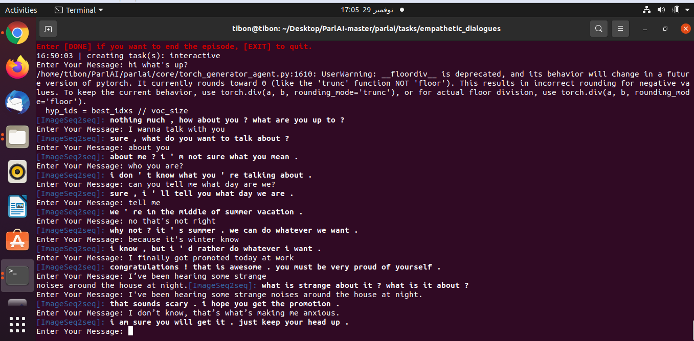

# Parlai-chatbot

In this project, we try to use the pytorch implementation of Towards Empathetic Open-domain Conversation Models to build a chatbot in Parlai
 and chat with it. For that, we use a novel dataset of 25k conversations grounded in emotional situations and a fine-tuned bert model
pick it from : https://dl.fbaipublicfiles.com/parlai/empatheticdialogues/models.

<h1>Dowload Dataset :</h1>
<br>
To download the EmpatheticDialogues dataset:

```shell
wget https://dl.fbaipublicfiles.com/parlai/empatheticdialogues/empatheticdialogues.tar.gz
```


<h1>Dowload model:</h1><br>

```shell
wget https://dl.fbaipublicfiles.com/parlai/empatheticdialogues/models/bert_finetuned_emoprepend1.mdl  # BERT, fine-tuned (EmoPrepend-1)
```

<h1>Installing ParlAI:</h1>
<br>
<h3>Standard Installation</h3>
If you want to use ParlAI without modifications, you can install it with:<br>

```shell
pip install parlai
```

<h3>Development Installation</h3>
If you want to make some modifacations of Parlai, you can set up a development environment by running the following commands:<br>

```shell
git clone https://github.com/facebookresearch/ParlAI.git ~/ParlAI
cd ~/ParlAI; python setup.py develop
```

<h1>Dependencies</h1>
Those version of libraries given are what the code was tested on:<br>

 - [Pytorch 1.10.0](https://pytorch.org/)<br>
 - [pytorch-pretrained-bert==0.6.2](https://pypi.org/project/pytorch-pretrained-bert/)<br>
 - [numpy (1.19.5)](https://numpy.org/devdocs/release/1.19.5-notes.html)<br>

<h1>Set up the Dataset:</h1>

To set up the dataset after you dowload it, you must run the build.py script to save it in the **./ParlAI** directory:<br>

```shell
$python build.py
```

<h1>Commands</h1>
<br>
<h3>Evaluate Bert model</h3>

To evaluate your bert-finetuned model, you should first create a directory ( **./test1** folder in my case) in which your evaluated model will be save it. After that, run the following commands:<br>

```shell
python retrieval_train.py \
--batch-size 32 \
--bert-dim 300 \
--cuda \
--dataset-name empchat \
--dict-max-words 250000 \
--display-iter 100 \
--embeddings None \
--empchat-folder ./empatheticdialogues/ \
--max-hist-len 4 \
--model bert \
--model-dir ./test1 \
--model-name model \
--optimizer adamax \
--pretrained ./bert_finetuned_emoprepend1.mdl \
--reactonly
```

<h3>Convert model to Parlai chatbot</h3>
To convert model into a model that we can use it in Parlai , we map the weights of the evaluated model over to something that can be used in ParlAI
by runnig the following commands:<br>

```shell
python convert_fairseq_to_parlai.py \
--input ./test1/checkpoint_best.pt \
--merge ./test1/bpe-merges.txt \
--vocab ./test1/bpe-vocab.json \
--output ./model.test --space True --activation gelu
```

<h1>Chat with your chatbot</h1>
**To chat with your Parlai model, you can run the following command on the terminal:**<br>

```shell
parlai interactive --model-file "${PRETRAINED_MODEL_PATH}"
```



